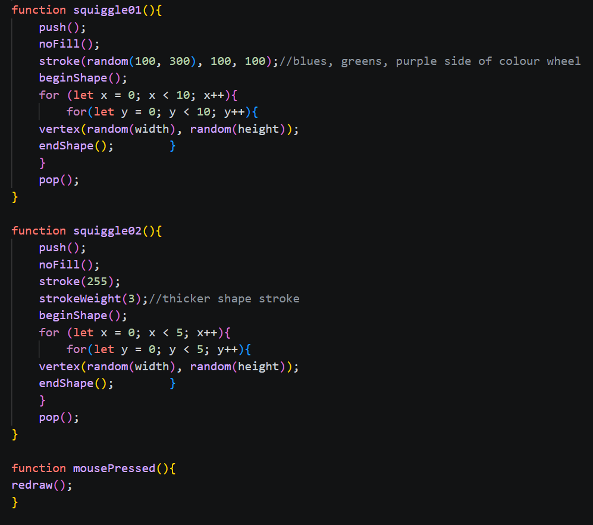

# Reflective Journal
## Prototyping: Website 

While setting up and making my GitHub repository and website for my course, I came across quite a few challenges. This was my first time working with GitHub and VS Code. I felt very overwhelmed and confused at first, but I just took each thing step by step and read over the class notes thoroughly, as well as looking at the terminology for using Markdown to create my website. I asked Sabine for help to go through how to link my journal to my GitHub pages. Once I understood how to link folders and some more of the terminology, I felt more at ease with the whole workflow of using VS Code and GitHub to document my work. After getting the base of my website set up, I think I will find it easier to add more images and links to it to expand it and treat it as a portfolio for my CART253 class at the end of the semester to show my peers and tutors back at my home University at the Glasgow School of Art. 

## Prototypting: Instructions

I wanted to have fun with p5 and experiment with different functions, shapes and colours for this assignment. For my first prototype, I wanted to create something quite simple and minimalist. I thought it could be nice to take a simple white square and make it into a grid of squares. I messed about with the size of the squares and how far apart they were. I created global variables for the size of the spaces between the shapes and a variable to control the distance from the outside of the canvas to the first row of squares. I thought the outcome looked like a side of a big die and enjoyed the contrast of the white squares against the black background. For my second prototype, I wasn’t sure what to make, but I started with rectangles randomly placed all over the canvas. I used the random function to randomise the position of the rectangles. I thought I would make more use of the random function with the rest of my prototype. I controlled the colour of the rectangles using random and then added a random rotation. I think my finished outcome looks a bit like sprinkles or confetti. 

The screenshot above shows part of my code for my 3rd prototype. I explored using the beginShape() and endShape () functions to create an irregular polygon. I added another white vertex shape on top of my colourful one to contrast the 2 shapes and make my prototype look more abstract. For my 2nd and 3rd prototype, I used the mousePressed function to redraw the canvas each time the mouse is pressed, adding interactivity that I could take further by adding more interactivity and personalisation to each shape. 
