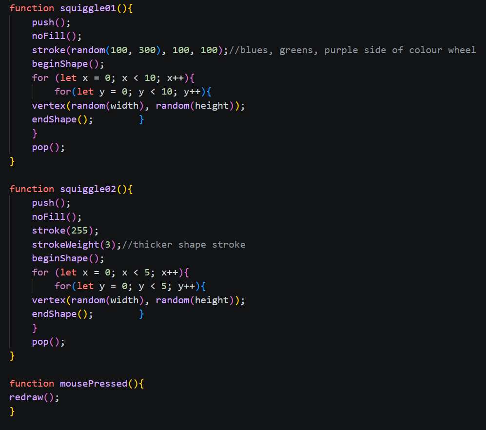

# Reflective Journal
## Prototyping: Website 

While setting up and making my GitHub repository and website for my course, I came across quite a few challenges. This was my first time working with GitHub and VS Code. I felt very overwhelmed and confused at first, but I just took each thing step by step and read over the class notes thoroughly, as well as looking at the terminology for using Markdown to create my website. I asked Sabine for help to go through how to link my journal to my GitHub pages. Once I understood how to link folders and some more of the terminology, I felt more at ease with the whole workflow of using VS Code and GitHub to document my work. After getting the base of my website set up, I think I will find it easier to add more images and links to it to expand it and treat it as a portfolio for my CART253 class at the end of the semester to show my peers and tutors back at my home University at the Glasgow School of Art. 

## Prototypting: Instructions

I wanted to have fun with p5 and experiment with different functions, shapes and colours for this assignment. For my first prototype, I wanted to create something quite simple and minimalist. I thought it could be nice to take a simple white square and make it into a grid of squares. I messed about with the size of the squares and how far apart they were. I created global variables for the size of the spaces between the shapes and a variable to control the distance from the outside of the canvas to the first row of squares. I thought the outcome looked like a side of a big die and enjoyed the contrast of the white squares against the black background. For my second prototype, I wasn’t sure what to make, but I started with rectangles randomly placed all over the canvas. I used the random function to randomise the position of the rectangles. I thought I would make more use of the random function with the rest of my prototype. I controlled the colour of the rectangles using random and then added a random rotation. I think my finished outcome looks a bit like sprinkles or confetti. 

The screenshot above shows part of my code for my 3rd prototype. I explored using the beginShape() and endShape () functions to create an irregular polygon. I added another white vertex shape on top of my colourful one to contrast the 2 shapes and make my prototype look more abstract. For my 2nd and 3rd prototype, I used the mousePressed function to redraw the canvas each time the mouse is pressed, adding interactivity that I could take further by adding more interactivity and personalisation to each shape. 

## Prototyping: Variables

For each of my prototypes I wanted to experiment with what you could create by using variables and get to grips with using variables in my code. Usually, I wouldn’t think to use individual global variables to determine the position, size or colour of an object, so it took me a bit to get into the swing of coding with them. I do see why they are useful; especially when there are so many objects on the screen, it is easy to make a quick change to a specific object at the top of your code instead of looking through the main draw loop looking for where to change it. I particularly like my prototype 03 because I like how you can change the colour of the circle with something as easy as your mouse position. I think there is room for development by maybe adding some rotation or more shapes that change to different colours. I used the map function to constrain the colour values to the size of the canvas, so you don’t lose any colours. In my prototype 01, I like the effect the blur filter adds to the circles. I think it makes the prototype look more visually interesting because once the circles have fallen to the bottom, they leave behind a trail of colour that blends to make it look like a painting or a rainbow. 

## Prototyping: Conditionals

This week, when I was creating each of my prototypes, I wanted to try to wrap my head around the concept of conditionals in my code. Each of my prototypes isn’t particularly complex, but I tried to combine all the skills I have learnt so far, such as using variables in my code. I found it difficult to understand how to add conditionals to my code this week. I found I had to talk myself through each step of my code to fully understand what was happening and try to fix any errors. With conditionals, I find it easier to understand if you think of it almost like a list of events; for example, if the mouse is over the circle, then change colour and if not, stay the same colour. My favourite prototype I made this week was prototype 03, where I was inspired by the Mr Furious challenge we did in class and made my own creature that, when the mouse is over the circle he turns orange to indicate he is angry, and when the mouse is pressed while inside the circle, his body and eyes turn red to indicate he is full of rage. I could develop this prototype to create more states of emotion for the creature, each triggered by a different event. For example, to make him change colour to pink to indicate he is happy, I could make a flower object that when near him, causes him to change to his happy state. 